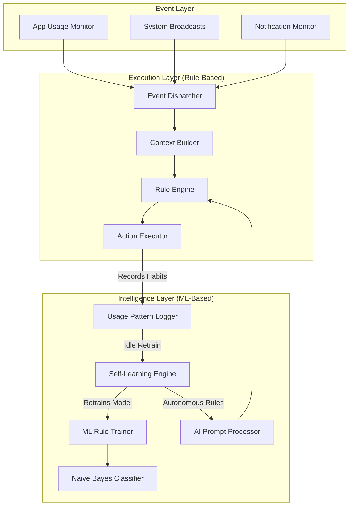

# AegisLayer

AegisLayer is a modular, event-driven Android system daemon that autonomously manages your device's behavior. It combines the reliability of a **Rule-Based Execution Engine** with the adaptive intelligence of an **On-Device Machine Learning Pipeline**.

## Architecture Overview

AegisLayer utilizes a **Hybrid Architecture**, dividing responsibilities between strict, battery-efficient rule execution and an intelligent ML engine that learns from your habits over time.

### 1. Execution Layer (The Muscle)
AegisLayer runs as a persistent Foreground Service. Event monitors (App Foreground, Screen State, Battery) emit events into a single `SharedFlow` bus. 
- The **Context Builder** accumulates these events into a flat state dictionary (e.g., `{"SCREEN_ON": true, "APP_FOREGROUND": "com.youtube"}`).
- The **Rule Engine** evaluates this snapshot against loaded rules. It uses an **edge-triggered** design, meaning actions are only fired the exact moment a condition becomes true, avoiding infinite loops.
- The **Action Executor** modifies the actual Android system (Brightness, DND, Volume, Rotation).

### 2. Intelligence Layer (The Brain)
AegisLayer features a pure-Kotlin, offline-only **Multinomial Naive Bayes Classifier**. 
- **AI Prompt:** Users can type natural language (e.g., *"mute when instagram opens"*). The ML model translates this text into strict tags, and the `AIPromptProcessor` builds a concrete Rule.
- **Autonomous Learning:** AegisLayer watches what you do. The `UsagePatternLogger` records a snapshot every time an action occurs. The system groups recurring habits (behaviors seen 3+ times).

### 3. Self-Learning Night School
To preserve battery, the ML engine does not train during the day. The `SelfLearningEngine` triggers only when:
1. It is midnight (11 PM - 4 AM), OR
2. The device is docked/charging for at least 2 minutes.

During retraining, the engine:
1. Generates synthetic training observations from your recent habits.
2. Rebuilds the ML model using hardcoded baselines + your specific habits.
3. **Autonomously generates new Rules** and injects them into the `RuleRepository`, automating your phone without you ever opening the app.

## Project Structure

- `com.aegislayer.daemon.service`: The `SystemControlService` foreground daemon.
- `com.aegislayer.daemon.engine`: The brains. Contains `RuleEngine`, `NaiveBayesClassifier`, `SelfLearningEngine`, and `AIPromptProcessor`.
- `com.aegislayer.daemon.actions`: The `ActionExecutor` for system modification.
- `com.aegislayer.daemon.receivers`: Event triggers like `AppUsageMonitor` and `EventProcessor`.
- `com.aegislayer.daemon.models`: Data structures (`Rule`, `SystemEvent`, `Condition`).
- `com.aegislayer.daemon.trace`: Real-time colored logging system.

## Permissions Required
Because AegisLayer manages system states, it requires several advanced permissions:
- `PACKAGE_USAGE_STATS` (To track foreground apps)
- `WRITE_SETTINGS` (To modify brightness and rotation)
- `MANAGE_NOTIFICATION_POLICY` (To toggle Do Not Disturb)
- `BIND_NOTIFICATION_LISTENER_SERVICE` (To read and monitor incoming notifications)

## Development
This project is built purely in Kotlin (zero external ML bindings like TensorFlow or ONNX) to keep the APK incredibly lightweight and battery-friendly.
1. Open the project in Android Studio.
2. Grant all requested permissions upon first launch.
3. Observe the `Trace Log` to see real-time rule evaluation and ML retraining events.
